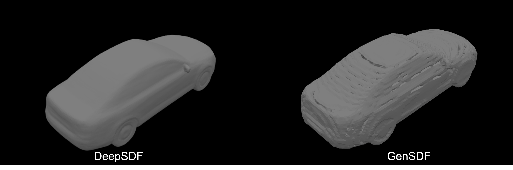
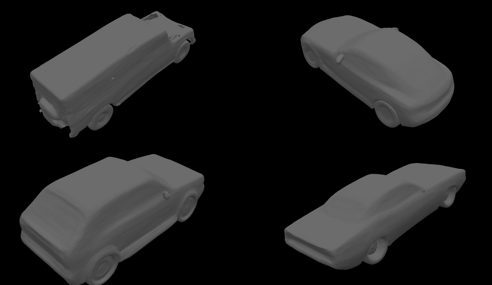

# CSC413/2516 Project

## DeepSDF

- [DeepSDF: Learning Continuous Signed Distance Functions for Shape Representation](https://arxiv.org/abs/1901.05103)

## Dataset

- Download ShapeNetV2 from [ShapeNet](https://www.shapenet.org/)
- Download the preprocessed tool with 
```bash
mkdir build
cd build
cmake ..
make
```
- Run the preprocessing tool with, this will generate .npz SDF files / .npz Mesh surface points from .obj mesh files
```bash
cd tools
python preprocess.py --dataset_dir /path/to/shapenetcorev2 --output_dir /path/to/output --executable /path/to/build/preprocess
```
- Create water-tight meshes from .obj files
```bash
pip install -r requirements.txt
cd tools
python convert_water_tight.py --dataset_dir /path/to/shapenetcorev2 --output_dir /path/to/output
```

## Evaluation

- Reconstruct using trained models, make sure you have at least 1 GPU with 8GB VRAM
```bash
python reconstruct.py -e examples/{experiment_name} --data /path/to/preprocessed_data --s /path/to/example_split --ckpt /path/to/ckpt
```

- evaluate the SDFs with pretrained ckpt in examples directory
```bash
python evaluate.py -e examples/{experiment_name} --data /path/to/preprocessed_data --s /path/to/example_split 
```

some example results:

